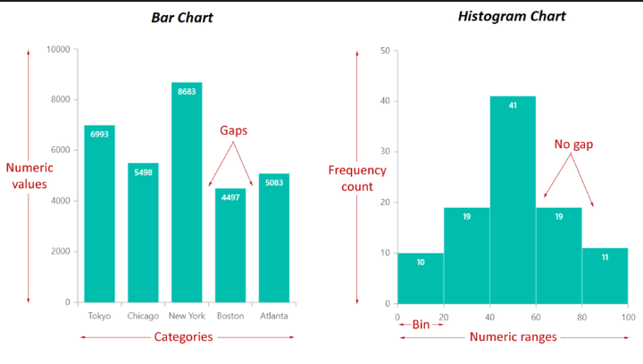

# Critical Thinking

## SIMPLE - Principles used to ensure the data is fit for purpose
- **Source** (Is it reliable)
- **Irrelevant** (Identify irrelevant data)
- **Missing** (Identify missing data)
- **Presentation** (Ensured it is presented appropirately)
- **Alteranative** (Look for alterative explanations)
- **Evidence** (Facts not Opinions, Assertions not Suppositions)

## How to ensure good data visualtisation?

### Andy Kirks Principles

- **Trustworthy** (Professional)
- **Accessible** (Suitable for people of all industries)
- **Elegant** (Simple)

## Tables

## Charts
- Line Charts
- Bar Charts
- Scatter Plots
- Histogram
- Deviation graph

## Maps

## Numbers