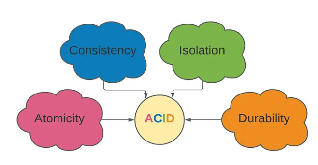
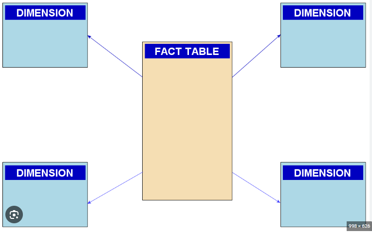
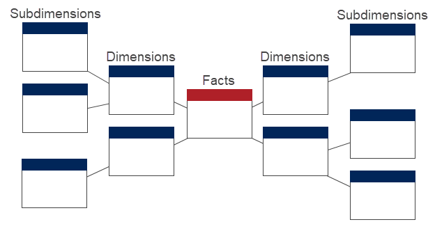

# Data Storage

### ETL (Extract, Transform, Load)
- Extract the data, Tranform the data, Load the data

### Relational Data Processing

**OLTP (Online Transaction Processing)**

A type of data processing that handles a large volume of online transactions in real time
- Database Transcations (payments recived, booking, orders taken, stock price movement)
- Requires high degree of normalisation
- Heavy write (a lot of updating of the DB), low read (not really looking at the DB)

**OLAP (Online Analytic Processing)**

A type of data processing used to analyse large datasets (typicalling in data warehouse and lakes)
- Designed to extract buisness itnelligence from OLTP
- Adds layers of abstraction and aggregation
- Heavy read, low write

### ACID (Atomicity, Consistency, Isolation, Durability)**

A set of principles that guarantee the reliability and integrity of database transactions

- **Atomicity** Each transaction must be treated as a single unit
- **Consistency** Each transaction must result in a valid database state
- **Isolation** Each transaction should not intefer with other transactions
- **Durability** The data must not be lost even if the system fails

## Data Warehouse

A Data Warehouse is a system that stores structured data that has been cleaned and processed for specific analytical and reporting purposes

- Designed for data analysis
- Only stores critical data
- Slices of the warehouse stored as Data Marts e.g. Mart Finance, Mart Sales, Mart Personal
- Examples Amazon Redshift, Snowflake, Oracle, Microsoft Azure Synapse Analytics

**Data Warehouse Approaches**

- Inmon Architecture (Top Down Approach, Normalised Data Warehouse created first, Data the summarised and distributed out to Data Marts, Harder to set up, easier to maintain)

- Kimbal Architecture (Bottom up approach, Seperate Data Marts created first, then place the warehouse around them, Easier to set up, harder to maintain)

**Dimensional Modelling**

- Kimbal Architecutre
- Instead of representing tables, represents people/ items/ objects
- Contain data corresponding to instances of objects (Product details, calendar info)
- Contains dimensional data

**Star Schema**

- A databse schema used in data warehousing to organise into central fact table surrounded by dimensional tables
- Fact tables join denormalised dimensional tables using foreign keys

**Snowflake Schema**

- Dimension tables are normalised
- Reducing data redundancy but potentially increasing query complexity

---

## Data Lakes

A data lake is a repositry that stores large amounts of raw data in its natural format (unstrcutred)

- Newer, made possible with Big Data technology
- Stores structured and unstructred data in original form
- Processed when analysis is needed, not when stored (Schema-On-Read)
- Low cost storage vs Warehouse
- Highly scalable, Highly agile

## Data Lakehouses

- Taakes the best aspect of Data Warehouses and Data Lakes
- Offers some strcutre and control, including ACID principles
- Flexible and scalable
- Often the architecture can be decoupled 
- Governace can be difficult

---

# Acitivty

**Difference between Databses, Date Warehouses and Data Lakes**
- Databases store current data for application and transactional operations
- Data Warehouses aggregates historical data from multiple sources for analysis often strcutred and semi-structred
- Data Lakes stores vast amounts of raw, structured, semi-stuctred and unstrcutered data for exploration and analaysis
